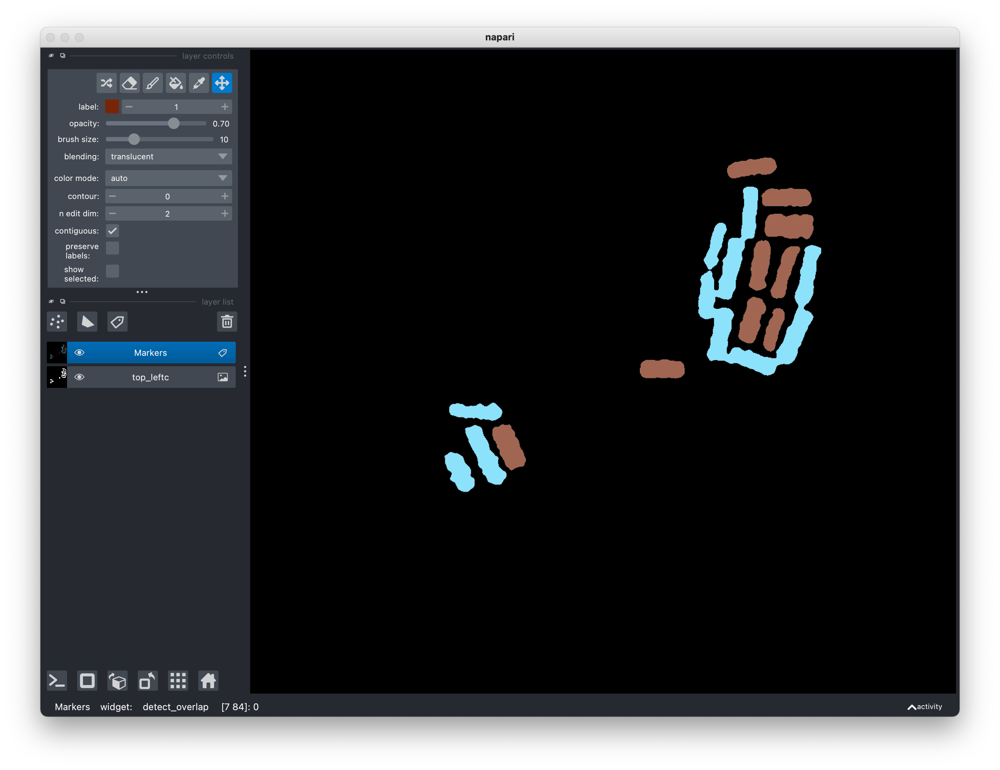
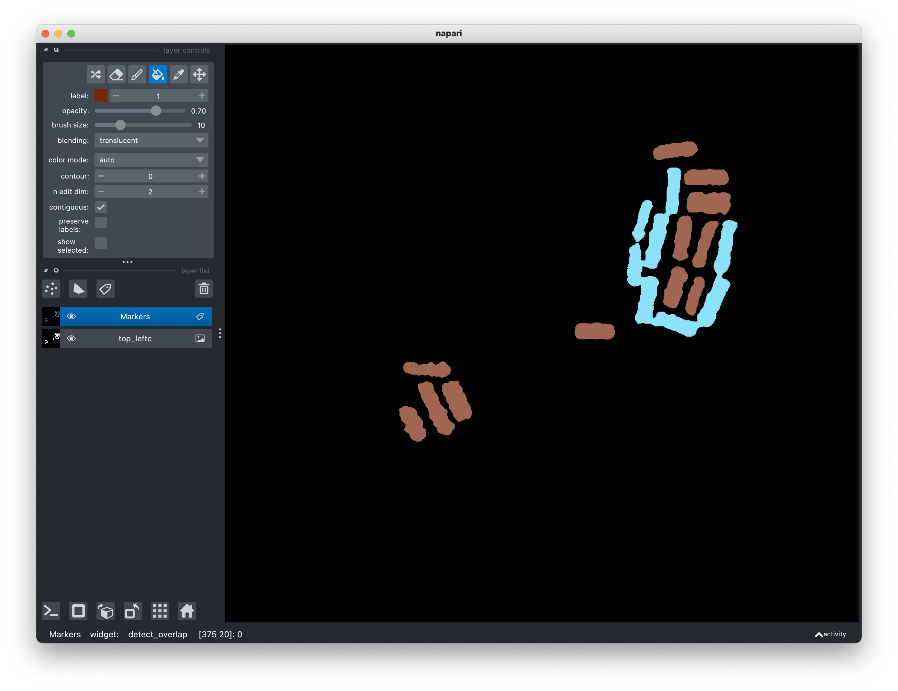
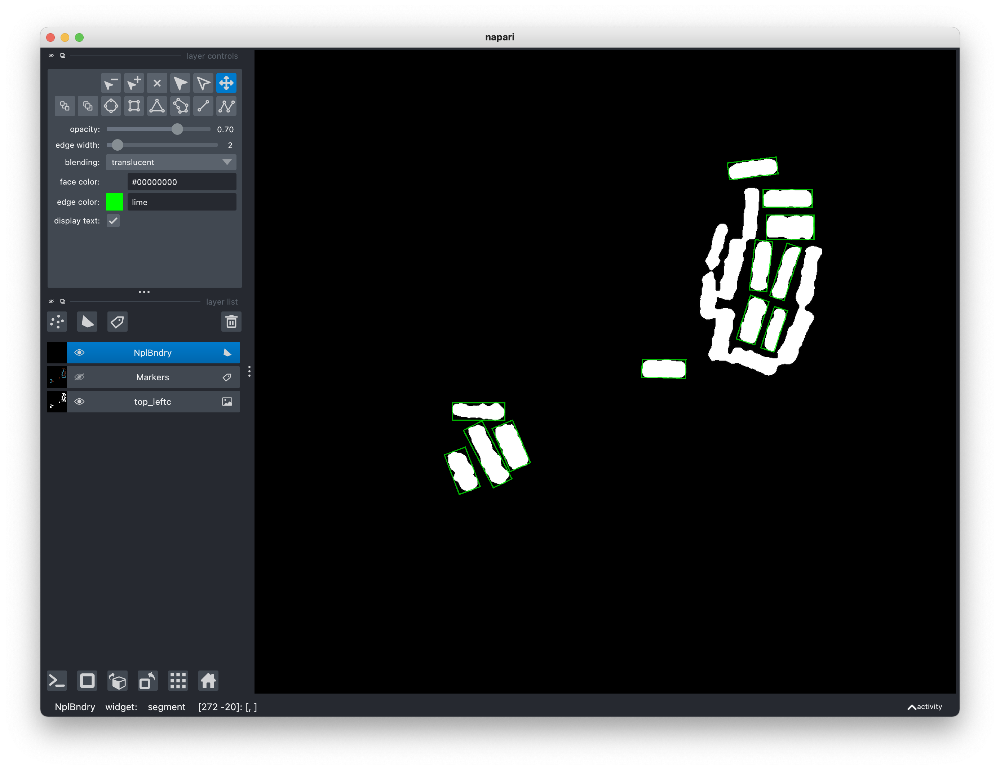
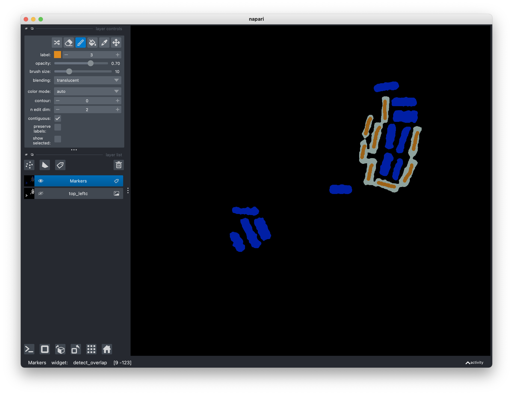
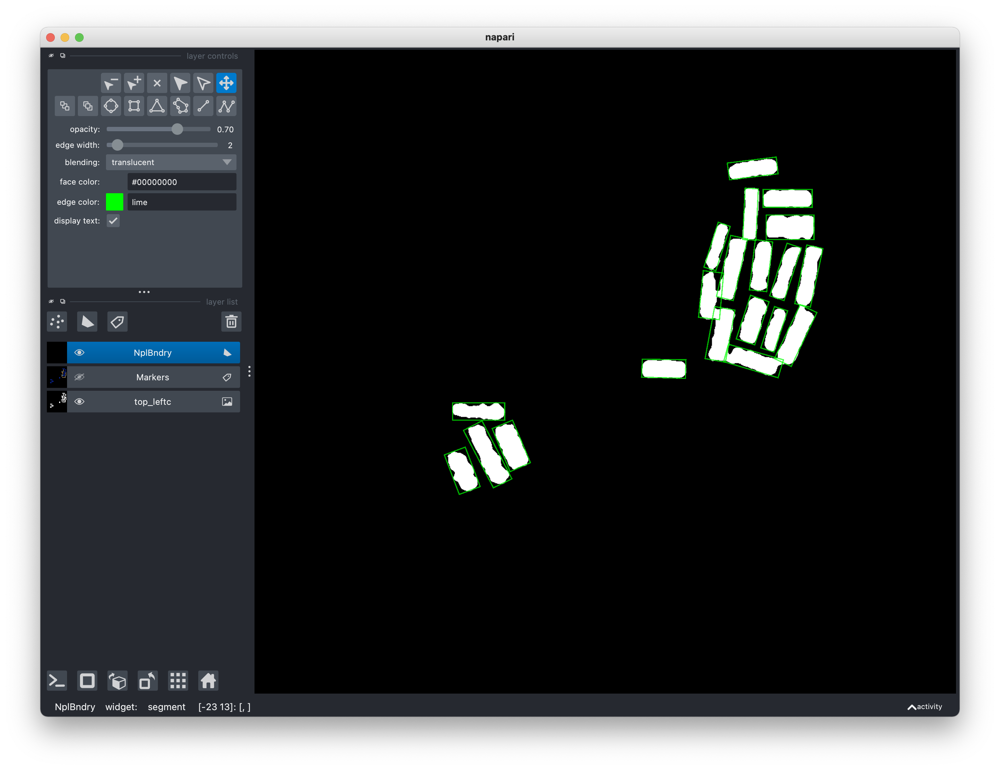
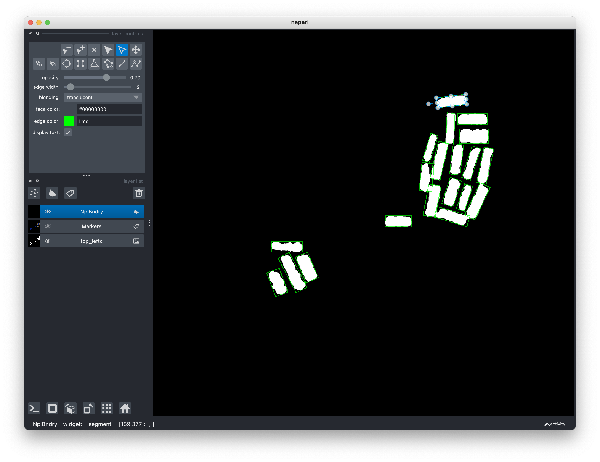

# NPLsizer
Python code to semi-automatically calculate the size of rectangular nanoplatelets from microscopy images.

# Installation
## Prerequisites
[Python >= 3.8](https://www.python.org/downloads/) is required for installation,
along with the following Python packages. 

- [numpy (1.24)](https://numpy.org/)
- [scipy (1.9)](https://scipy.org/)
- [pillow (10.1)](https://python-pillow.org/)
- [PyQt (5.15)](https://pypi.org/project/PyQt5/)
- [magicgui (0.8)](https://pyapp-kit.github.io/magicgui/)
- [napari (0.4)](https://napari.org/stable/)
- [opencv (4.8)](https://opencv.org/)
- [scikit-image (0.20)](https://scikit-image.org/)
- [pyDM3reader (1.5)](https://github.com/piraynal/pyDM3reader)

Please note that I have tested the code only with Python 3.8 with the specific
versions of the dependencies listed above inside parentheses, so make sure all
the dependencies work if you are using a later version.

## Installation using Conda
I recommend using the [Conda Package Manager](https://conda.io/projects/conda/en/latest/user-guide/index.html) to install all the prerequisites. Make sure to use 
`conda >= 22.11`.

1.  After installing `conda`, it is recommended to use a clean virtual
environment for installing all the prerequisites. The code below creates a
new environment `myenv` with `python 3.8`.
```bash
conda create -y -n myenv -c conda-forge python=3.8
conda activate myenv
```

2.  [*Optional*] Sometime `conda` has difficulty in locating the appropriate set
   of compatible packages. It may help to change the default solver to
`libmamba`.
```bash
conda update -n base conda
conda install -n base conda-libmamba-solver
conda config --set solver libmamba
```

3. Install most of the prerequisites. `scikit-image` and `pillow` should be
   automatically installed by `conda` as a dependency of some of these packages.
```bash
conda install -c conda-forge --override-channels numpy scipy napari pyqt magicgui opencv
```

4. Download a `zip` file of `pyDM3reader` from the website listed above and save
   it in your working directory.
```bash
pip install pyDM3reader-1.5.zip
```

5. Update everything. 
```bash
conda update --all
```

# User Guide
Before using the program, it may be helpful to gain some familiarity with the
GUI features of the [Napari
viewer](https://napari.org/stable/tutorials/fundamentals/viewer.html#layout-of-the-viewer).

## Starting the program
Download the source files and save them to a new directory. Open the terminal
and navigate to the directory where you saved the source files.

Make sure that the `conda` environment where you installed all the packages
earlier is activated. For example, if you installed the packages in `myenv`,
type at the terminal
```bash
conda env list
```

You will see a list of existing environments with a `*` next to `myenv`. If this
is not the case, please activate `myenv` thus
```bash
conda activate myenv
```
Note that if you launch a new shell, you may need to perform the activation
process again.

Start the program from the command line
```bash
python NPLsizer.py
```

The Napari viewer window will launch. Almost all relevant functions are listed
under the `Window` tab on the menubar of the main window.


## Reading and writing images
Images to be analyzed are expected to be grayscale (array element data type
*int*/*float*) or binary (data type *bool*). RGB images, if chosen, will be
converted to grayscale.

To read an image, click on `Window > Read image` and enter/select the
appropriate values for each field.

Any image format that can be read by `scikit-image` is acceptable. In addition,
numpy `.npy` and `.dm3` files can also be read. For `.dm3` files, you may
save its metadata in a separate file. Note that only one `.dm3` file can be
processed at one time, i.e., at any given time you should have only one `.dm3`
file open in the viewer. This restriction does not apply for other file formats.

By default, the file name is used as the name of the image layer in the viewer,
but you can supply a different name in the field `Image layer name`. Note that
layer names are unique, so if you load an image with the same layer name as an
existing layer, the existing layer will be overwritten.

To save/write an image, click on `Window > Write image` and enter/select the
appropriate values for each field.

Output file format is determined from the file name extension. Any format that
`scikit-image` can handle is allowed, in addition to `.npy` format. File output
format cannot be `.dm3`.

## Histogram manipulation
After loading an image, it is recommended to perform some histogram manipulation
(`Window > Histogram`). The resulting output will be added as a new image layer.
You may hide existing image layers to aid visibility. In case of adaptive
histogram equalization (CLAHE), you may need to adjust the parameters. Note that
after changing the parameters, if the output layer will be overwritten if you
use the same name for the output layer. The grid view option of the viewer may
help you visually decide on choosing the desired output. Feel free to delete any
layers that you no longer need.

## Filters
Several filters are available in the tabs `Window > Filter` and `Window >
Denoise`.  For each case, make sure that you choose the correct input image
layer. You will need to play with the input parameters to decide what works for
you. Note that for some parameter choices, the underlying functions may take a
while to return the output. For details on each filter, please consult the
appropriate documentation as listed below:

* [Mean filter](https://docs.opencv.org/4.8.0/d4/d86/group__imgproc__filter.html#ga8c45db9afe636703801b0b2e440fce37)
* [Median filter](https://docs.opencv.org/4.8.0/d4/d86/group__imgproc__filter.html#ga564869aa33e58769b4469101aac458f9)
* [Gaussian filter](https://docs.opencv.org/4.8.0/d4/d86/group__imgproc__filter.html#gaabe8c836e97159a9193fb0b11ac52cf1)
* [TV Bregman](https://scikit-image.org/docs/stable/api/skimage.restoration.html#skimage.restoration.denoise_tv_bregman)
* [TVL1](https://docs.opencv.org/4.8.0/d1/d79/group__photo__denoise.html#ga7602ed5ae17b7de40152b922227c4e4f)
* [Nonlocal Means](https://docs.opencv.org/4.8.0/d1/d79/group__photo__denoise.html#ga4c6b0031f56ea3f98f768881279ffe93)
* [Bilateral](https://docs.opencv.org/4.8.0/d4/d86/group__imgproc__filter.html#ga13a01048a8a200aab032ce86a9e7c7be)
* [Kuwahara](https://github.com/yoch/pykuwahara)

## Thresholding
For global thresholding using Otsu's method, choose `Window > Threshold >
Threshold` (see [here](https://docs.opencv.org/4.8.0/d7/d1b/group__imgproc__misc.html#gae8a4a146d1ca78c626a53577199e9c57) for more details).

For adaptive thresholding, choose `Window > Threshold > Adaptive Threshold` (see 
[here](https://docs.opencv.org/4.8.0/d7/d1b/group__imgproc__misc.html#ga72b913f352e4a1b1b397736707afcde3) for more details on the parameters).

Note that the output of a thresholding operation is a binary array (data type
*bool*).

## Morphological operations
Several common morphological operations are listed in `Windows > Morphology`.
Note that both inputs and outputs to these operations are binary images.

A useful workflow after thresholding is `Window > Morphology > Remove Objects`
followed by `Window > Morphology > Fill Holes`.
 `Remove Objects` removes small foreground objects (in white) from a black
background and `Fill Holes` fills small background holes (in black) with a white
foreground region. 

For both of these operations, I suggest that you run first
without the `shapes` and `labels` parameters. Then, if there are still objects
that you wish to remove, add a `Shapes` and/or `Labels` layer from the labels
panel in the viewer. Draw the shapes around the regions to be removed. You can
draw the labels as well and mark the labels as `1`. All pixels within the shapes
and those labeled as `1` will be marked as background, i.e., removed. A similar
workflow applies for `Fill Holes` as well. Afterwords, delete the shape and
label layers or alter them and run again.

## Segmentation
The aim here is to identify rectangular regions of white foreground against a
black background. First label the image (make sure to choose the right layer)
using `Window > Segmentation > Label`. 

Rectangular regions are identified using oriented bounding boxes (OBB) based on
tolerances for area and perimeter. All regions whose OBBs satisfy both
tolerances will be considered as a rectangular object.  In other words, the
`area_region/area_OBB <= area_tolerance` and `perimeter_region/perimeter_OBB <=
perimeter_tolerance`. The result will be a Labels layer containing at most two
labels -- `1` and `2`. Those with label `1` are considered as isolated
rectangular regions and those with `2` are regions that are not and may need
further attention. 



It is possible that some regions are misclassified (depends on the tolerance);
use the `Pick mode` and `Activate the fill bucket` tools in the `layer control`
panel of the viewer to assign correct labels to all regions.



At this stage, hopefuly, most regions are classified as isolated rectangles,
with a few that are not isolated. The latter may be touching rectangles or
regions that are not of interest. Touching regions can be segmented with
a marker-controlled Watershed algorithm. However, if you are not interested in
these regions any more, just click on `Window > Segmentation > Segment` and
bounding rectangles will appear on the regions labeled as `1`.



To proceed with the Watershed algorithm, use `Activate the paint brush` tool in
the `layer control` panel to add markers with label `3`. The number of markers
should be equal to the number of segmented regions. Each marker can be a short
line or even a small region, though the quality of the segmentation will greatly
improve if your markers are commensurate with the desired rectangular regions.
Make sure that the markers do not extend outside any region, i.e., limited
within the white areas. Furthermore, if there are areas you do not wish to
segment of take into further consideration, use the `Activate the fill bucket`
tool in the `layer control` panel to label them as `4` or anything `> 3`. 



Click on `Window > Segmentation > Segment`.
In the segmentation step, you can also choose the width of the OBB edges and
their color. A color is specified as a string wiht hex value (in lower case)
starting with ``#`` or any of 
[VisPy colors](https://github.com/vispy/vispy/blob/main/vispy/color/_color_dict.py).



If you would like to alter the rectangles by a small amount, you can do so by
directly exposing the handles on each rectangle.



In the rather unfortunate case that your original image quality is so poor that
any of the preceeding steps cannot be reliably performed, you can directly add a
Shapes layer and draw a bunch of rectangles.

## Calculating the OBB sizes
Size statistics can be written to a file simply from `Window > Get particle
size`. In case of input `.dm3` files, the final size will be in the same unit as
in the original input image. Of course, for other file formats, the sizes will
be in pixels.
